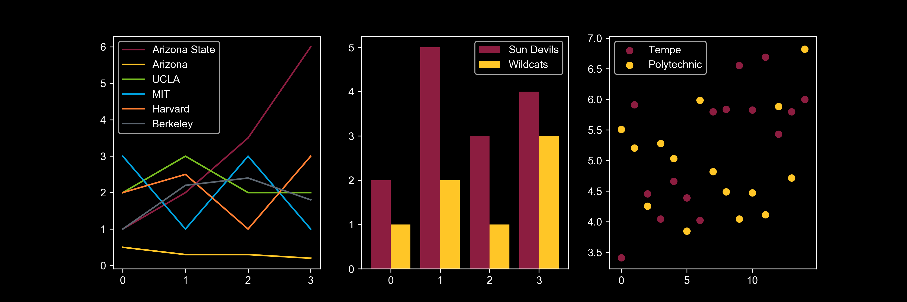

# ASU `matplotlib` styles

This is a set of styles for `matplotlib` that match the color schemes and brand guide for Arizona State University. Use this to easily make charts that look on-brand and fit well in ASU presentations.

## Available styles

Eventually there will be multiple styles with different backgrounds available. For now the only style available is the `asu-dark` style, which works well on the black-background slides in the ASU PowerPoint template. Examples of available styles are shown below.

### `asu-dark`



## Installation

Clone or download this repository (big green button above), and copy the contents of the `styles` folder into the `stylelib` subfolder of your `matplotlib` configuration directory (you may need to create the `stylelib` directory). For me, this is `~/.matplotlib/stylelib`. You can find your configuration directory by running

```
python -c 'import matplotlib; print(matplotlib.get_configdir())'
```

Create a `stylelib` subdirectory of that directory if it isn't already there, and copy the contents of the styles directory into the `stylelib` directory. Make sure that the individual files get copied, rather than the `stylelib` folder becoming a subdirectory of the `stylelib` directory.

## Use

Just run

```python
plt.style.use('asu-dark')
```

and all future plots in that session will use the `asu-dark` color scheme.

## License

This is under a [CC0 license](https://creativecommons.org/share-your-work/public-domain/cc0/), which means I waive all my copyright interest in this work. The ASU Brand Guide is ASU property. Please don't use these styles to imply affiliations with ASU that don't exist.